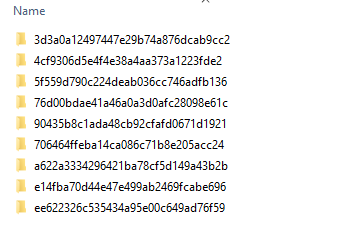
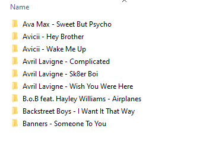
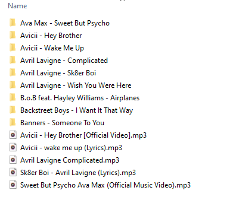
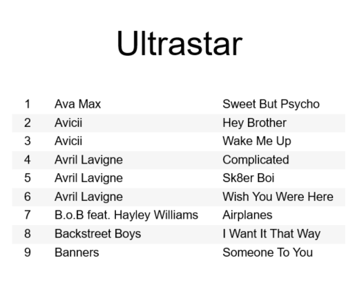

# Ultrastar Organizer

Cleanup and organize your [Ultrastar Deluxe](https://usdx.eu/) library with this simple command line tool.

## Table of Contents
* [Comands](#commands)
    * [Reformat](#reformat)
    * [Automatch](#automatch)
    * [Tracklist](#tracklist)
    * [Minimize](#minimize)
    * [Search](#search)
    * [Stats](#stats)
    * [Coverart](#coverart)
* [Usage](#usage)

<a name="usage"/>

## Usage

1. Make sure Java 17 is installed ([Eclipse Temurin](https://adoptium.net/temurin/releases)).
2. Download the latest version of this program [here](https://github.com/jorisguffens/UltrastarOrganizer/releases).
3. Start with `java -jar UltrastarOrganizer-<version>.jar`

<a name="commands"/>

## Commands

<a name="reformat"/>

### Reformat

This will rename all files and sub directories to a conform naming scheme.
It will also search for missing audio, video, and image files inside the same directory
if they are missing from the info file.


| Before                                                       | After                                                      |
|--------------------------------------------------------------|------------------------------------------------------------|
|  |  |

<a name="automatch"/>

### Automatch

This program will move each audio file in the root directory to the correct sub-directory, 
it will also run the [reformat](#reformat) command for the matched sub-directories.

| Before                                                         | After                                                        |
|----------------------------------------------------------------|--------------------------------------------------------------|
|  |  |

<a name="tracklist"/>

### Tracklist

This program generates a tracklist in an external file. Very useful if you want to print a list.

| Option           | Description                                                                                           |
|------------------|-------------------------------------------------------------------------------------------------------|
| `--type <value>` | Tracklist type, valid values are: <br/>- `ODT` OpenOffice Document<br/>- `CSV` Comma Separated Values |

**OpenOffice Document Example**




<a name="minimize"/>

### Minimize

Minimize the size of your library by downscaling background and cover images.

| Option                          | Description                                             |
|---------------------------------|---------------------------------------------------------|
| `--remove-backgrounds`          | Clear up more space by removing background images.      |
| `--max-cover-size <value>`      | The max size of cover images. Empty = no shrinking      |
| `--max-background-size <value>` | The max size of background images. Empty = no shrinking |


<a name="search"/>

### Search

Search your library by text or some special options.

| Option                 | Description                                  |
|------------------------|----------------------------------------------|
| `--query <value>`      | Search for text in title & artist.           |
| `--has-background`     | Tracks with a background image               |
| `--has-no-background>` | Tracks without a background image            |
| `--has-cover`          | Tracks with a cover image                    |
| `--has-no-cover`       | Tracks without a cover image                 |
| `--has-video`          | Tracks with a video                          |
| `--has-no-video`       | Tracks without a video                       |
| `--multiple-versions`  | Directories that contain multiple song files |
| `--duet`               | Tracks that are duets                        |

You can use multiple options together, only results that apply to all options are returned.


<a name="stats"/>

### Stats

You can see stats of your library with this simple command.

**Example output**
```
Directories: 1002
Total Tracks: 1016
Duets: 15
Disney songs: 26
Total size: 5.59GB
Average directory size: 5.72MB
```


<a name="coverart"/>

### Coverart
#### Download

You can download missing cover art files automatically with this command.

This will use the [Spotify Web API](https://developer.spotify.com/documentation/web-api/), 
this only works with your own account (premium not required), you must also create a developer 
application [here](https://developer.spotify.com/dashboard/applications). 
The credentials of this application will be used to query the API.

| Option                                | Description                                            |
|---------------------------------------|--------------------------------------------------------|
| `--spotify <clientId>:<clientSecret>` | Use the spotify API with the given client id & secret. |
| `--market <countryCode>`              | A 2-letter country code to search in.                  |

### diff

This command will compare your library against another library or [tracklist.csv](#tracklist).

* To compare a tracklist: `diff <path/to/file>`
* To compare another library: `diff <path/to/directory>`
